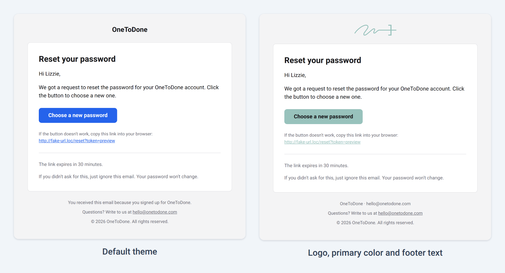
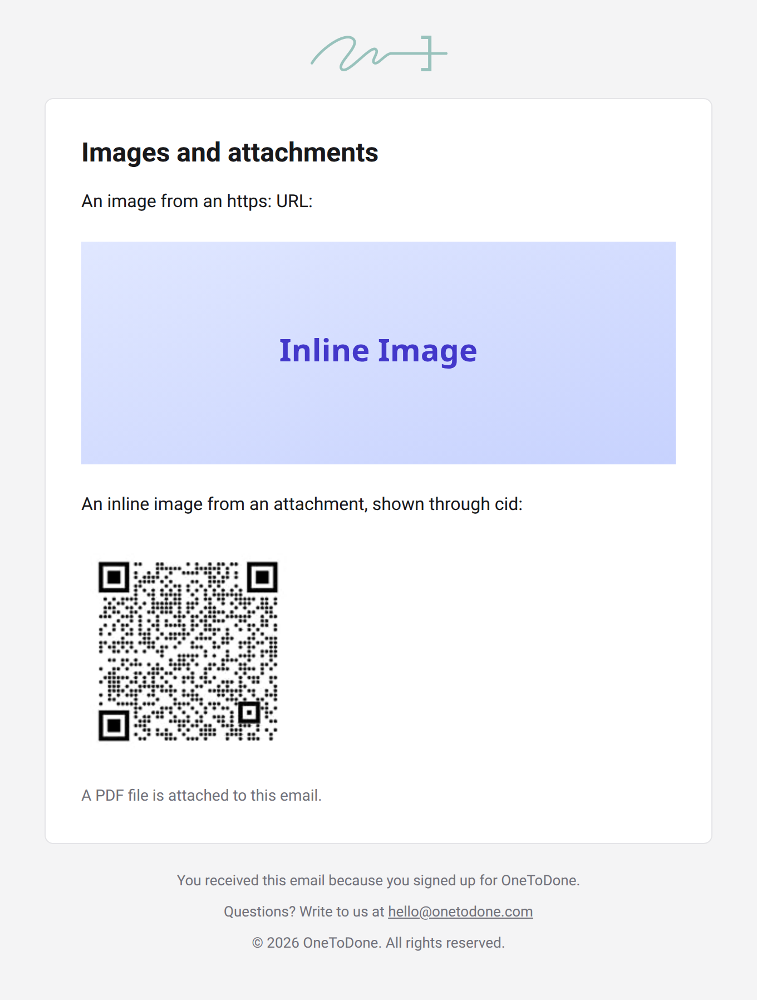

# Customization

There are four levels of customization, from a few settings to full control:

1. [Branding and theme](#1-branding-and-theme): logo, company name, colors and footer.
2. [Texts and locales](locales.md): reword any text or add a language.
3. [Layout](#3-layout): replace the header, footer and document around every email.
4. [Templates](#4-templates): add your own templates or replace built-in ones.

The examples below reuse `transport`, `from` and `branding` from the [quick start](../README.md#quick-start).

## 1. Branding and theme



```ts
import type { Branding } from '@onetodone/mailer'

const branding: Branding = {
  companyName: 'My App',
  appUrl: 'https://example.com',
  supportEmail: 'support@example.com',
  logoUrl: 'https://example.com/email/logo.png',
  logoWidth: 120,
  logoHeight: 32,
  footerText: 'You received this email because you signed up for My App.',
  theme: { primary: '#7c3aed', radius: 12 },
}
```

| Field          | Description                                                                                                                                 |
| -------------- | ------------------------------------------------------------------------------------------------------------------------------------------- |
| `companyName`  | Required. Shown in the header when there is no logo, in the logo's alt text and in the copyright line. Texts can use it as `{companyName}`. |
| `appUrl`       | Required. Absolute `http:` or `https:` link behind the logo or company name.                                                                |
| `supportEmail` | Required. Address in the footer's support line.                                                                                             |
| `logoUrl`      | Absolute `http:` or `https:` URL of the logo image. Without it, the header shows the company name.                                          |
| `logoWidth`    | Logo width in pixels. Default `120`.                                                                                                        |
| `logoHeight`   | Logo height in pixels. Keeps the header's height while images are blocked.                                                                  |
| `footerText`   | Extra line at the top of the footer, such as why the recipient gets the email.                                                              |
| `theme`        | Colors and corner radius, all optional.                                                                                                     |

Theme colors are HEX values such as `#3b82f6` or `#fff`.

| Token         | Used for                                     | Default                                                     |
| ------------- | -------------------------------------------- | ----------------------------------------------------------- |
| `primary`     | Buttons and links                            | `#2563eb`                                                   |
| `primaryText` | Text on `primary`, such as button labels     | White, or `#18181b` when white is hard to read on `primary` |
| `background`  | Page around the email card                   | `#f4f4f5`                                                   |
| `surface`     | Email card                                   | `#ffffff`                                                   |
| `text`        | Main text                                    | `#18181b`                                                   |
| `mutedText`   | Notes, footer and fallback links             | `#71717a`                                                   |
| `border`      | Card border and dividers                     | `#e4e4e7`                                                   |
| `radius`      | Corner radius of the card and buttons, in px | `8`                                                         |

Tips for the logo:

- Use an absolute `https:` URL to a PNG. Many email clients do not display SVG.
- Set `logoWidth` and `logoHeight` to the displayed size, and serve an image twice that size so it stays sharp on high-density screens.
- A transparent PNG that reads well on both light and dark backgrounds holds up best when a client switches to dark mode.

## 2. Texts and locales

See [texts and locales](locales.md).

## 3. Layout

The built-in layout centers the email in a 600px card. The logo or company name sits above the card, and the footer holds the footer text, the support address and a copyright line. To replace it, pass a layout from `defineLayout`:

```ts
import { createMailer, defineLayout, html } from '@onetodone/mailer'

const layout = defineLayout(({ branding, theme, locale, subject, preheader, content, messages }) => ({
  html: html`<!DOCTYPE html>
<html lang="${locale}">
<head><meta charset="utf-8"><title>${subject}</title></head>
<body style="margin:0;background-color:${theme.background};">
<div style="display:none;">${preheader}</div>
<table role="presentation" width="100%" border="0" cellpadding="0" cellspacing="0">
<tr><td align="center" style="padding:24px 12px;">
<table role="presentation" width="100%" border="0" cellpadding="0" cellspacing="0" style="max-width:600px;background-color:${theme.surface};">
<tr><td style="padding:32px;">${content.html}</td></tr>
<tr><td style="padding:0 32px 32px;font-family:Arial,sans-serif;font-size:13px;color:${theme.mutedText};">
${messages.footerSupport} <a href="mailto:${branding.supportEmail}">${branding.supportEmail}</a>
</td></tr>
</table>
</td></tr>
</table>
</body>
</html>`,
  text: `${content.text}\n\n--\n${messages.footerSupport} ${branding.supportEmail}`,
}))

const mailer = createMailer({ transport, from, branding, layout })
```

A layout receives:

| Field       | Description                                                                 |
| ----------- | --------------------------------------------------------------------------- |
| `branding`  | Validated branding with defaults applied.                                   |
| `theme`     | Theme tokens with defaults applied, the same object as `branding.theme`.    |
| `locale`    | Locale of the email, for the `lang` attribute.                              |
| `subject`   | Subject of the email, for the document title.                               |
| `preheader` | Inbox preview text. Empty when the template has none.                       |
| `content`   | The rendered body: `content.html` (markup) and `content.text` (plain text). |
| `messages`  | Layout texts for the locale: `footerSupport` and `footerRights`.            |

It returns the full `html` document, built with the `html` tag, and the full plain-text version as `text`. The `html` tag escapes every interpolated value and inserts `content.html` as markup.

## 4. Templates



Create a template with `defineTemplate` and register it under `templates`. The template's `name` must match its key:

```ts
import { createMailer, defineTemplate } from '@onetodone/mailer'
import { z } from 'zod'

const orderShipped = defineTemplate({
  name: 'orderShipped',
  schema: z.object({
    orderId: z.string(),
    trackUrl: z.url({ protocol: /^https?$/ }),
    userName: z.string().optional(),
  }),
  render: ({ props, ui, t }) => ({
    subject: `Order #${props.orderId} has shipped`,
    preheader: 'Your order is on its way.',
    body: [
      ui.heading('Your order is on its way'),
      props.userName !== undefined && ui.paragraph(t('common.greeting', { name: props.userName })),
      ui.paragraph(`Order #${props.orderId} has left our warehouse. Follow the delivery with the button below.`),
      ui.button('Track order', props.trackUrl),
      ui.linkFallback(props.trackUrl),
    ],
  }),
})

const mailer = createMailer({ transport, from, branding, templates: { orderShipped } })

await mailer.send('orderShipped', {
  to: 'lizzie@example.com',
  props: { orderId: '1042', trackUrl: 'https://example.com/orders/1042/tracking' },
})
```

`send` and `render` autocomplete `orderShipped` and check its props against the schema's input type. Any [Standard Schema](https://standardschema.dev) library works for `schema`, such as zod, valibot or arktype. Invalid props throw `INVALID_PROPS` with the schema's issues as `cause`.

`render` receives:

| Field      | Description                                                                                                |
| ---------- | ---------------------------------------------------------------------------------------------------------- |
| `props`    | Props after validation, with the schema's defaults and transforms applied.                                 |
| `ui`       | Content blocks styled with the theme.                                                                      |
| `t`        | Texts for the email's locale, with placeholders filled in: `t('common.greeting', { name })`. See below.    |
| `t.html`   | The same texts as markup: the text and plain values are escaped, and `html` values are inserted as markup. |
| `format`   | `format.duration(minutes)` and `format.dateTime(date, timeZone?)` for the email's locale.                  |
| `locale`   | Locale of the email.                                                                                       |
| `branding` | Validated branding with defaults applied.                                                                  |
| `theme`    | Theme tokens with defaults applied.                                                                        |

It returns the `subject`, an optional `preheader` (the inbox preview text) and the `body` blocks in order. `false`, `null` and `undefined` entries in `body` are skipped, so conditional blocks can stay inline.

| Block                                   | Renders                                                                                                                                                                                                                                                     |
| --------------------------------------- | ----------------------------------------------------------------------------------------------------------------------------------------------------------------------------------------------------------------------------------------------------------- |
| `ui.heading(text, { level })`           | A heading, level 1 (the default), 2 or 3.                                                                                                                                                                                                                   |
| `ui.paragraph(text)`                    | Body text. Line breaks in a string become `<br>`.                                                                                                                                                                                                           |
| `ui.button(label, url)`                 | A button that also renders in Outlook for Windows.                                                                                                                                                                                                          |
| `ui.linkFallback(url)`                  | The link as text under a "copy this link" line, for readers whose button does not work.                                                                                                                                                                     |
| `ui.code(value)`                        | A large monospace code, such as a one-time password.                                                                                                                                                                                                        |
| `ui.image(src, { alt, width, height })` | An image from an `http:` or `https:` URL, or an [inline image](sending.md#attachments-and-inline-images) through `cid:`. `width` defaults to 534 px, the width of the content, and the image shrinks on narrow screens. The plain-text version shows `alt`. |
| `ui.note(text)`                         | Smaller muted text, such as "If this wasn't you, ignore this email."                                                                                                                                                                                        |
| `ui.divider()`                          | A horizontal rule.                                                                                                                                                                                                                                          |
| `ui.spacer(size)`                       | Vertical space in pixels. Default `16`.                                                                                                                                                                                                                     |
| `ui.raw(html, text)`                    | Your own trusted markup, with its plain-text version.                                                                                                                                                                                                       |

Every block renders both HTML and plain text, so the plain-text version of the email comes with no extra work. Strings passed to blocks are escaped. For markup such as a link inside a sentence, use the `html` tag, which escapes every interpolated value:

```ts
import { html, safeUrl } from '@onetodone/mailer'

ui.paragraph(html`Read the <a href="${safeUrl(props.guideUrl)}">setup guide</a> before you start.`)
```

The plain-text version of that paragraph shows the link as `setup guide (https://…)`.

- `safeUrl(url)` returns the normalized URL. It throws `UNSAFE_URL` for anything but an absolute `http:` or `https:` URL, such as `javascript:` or a relative path.
- `ui.button`, `ui.linkFallback` and `ui.image` check their URL the same way; `ui.image` also accepts a `cid:` reference. Validate links in the schema, as `trackUrl` above does, to report bad links as `INVALID_PROPS` before rendering.
- `raw(markup)` inserts trusted markup without escaping. Never pass user input to `raw` or `ui.raw`.

### Replacing a built-in template

Register a template under a built-in name to replace that template. `send` then expects the replacement's props:

```ts
const resetPassword = defineTemplate({
  name: 'resetPassword',
  schema: z.object({ code: z.string().regex(/^\d{6}$/) }),
  render: ({ props, ui }) => ({
    subject: 'Your password reset code',
    body: [
      ui.heading('Reset your password'),
      ui.paragraph('Enter this code to choose a new password:'),
      ui.code(props.code),
      ui.note("If you didn't ask for this, ignore this email."),
    ],
  }),
})

const mailer = createMailer({ transport, from, branding, templates: { resetPassword } })

await mailer.send('resetPassword', { to: 'lizzie@example.com', props: { code: '482913' } })
```

### Texts of custom templates

Give a template its own texts with `messages`. `en` is required and lists every text key. Other locales can leave out any key, which then falls back to English:

```ts
const orderShipped = defineTemplate({
  name: 'orderShipped',
  schema: z.object({ orderId: z.string(), trackUrl: z.url({ protocol: /^https?$/ }) }),
  messages: {
    en: {
      subject: 'Order #{orderId} has shipped',
      intro: 'Your order from {companyName} is on its way.',
      button: 'Track order',
    },
    be: {
      subject: 'Замова №{orderId} адпраўлена',
      intro: 'Ваша замова ад {companyName} ужо ў дарозе.',
      button: 'Адсачыць замову',
    },
  },
  render: ({ props, ui, t }) => ({
    subject: t('orderShipped.subject', { orderId: props.orderId }),
    body: [
      ui.paragraph(t('common.greetingAnonymous')),
      ui.paragraph(t('orderShipped.intro')),
      ui.button(t('orderShipped.button'), props.trackUrl),
      ui.linkFallback(props.trackUrl),
    ],
  }),
})
```

- The texts live in a section named after the template: `t` takes `'orderShipped.subject'` and the other keys of `en`, plus the `common` keys. Your editor autocompletes them, and any other key is a type error.
- Placeholders work as in the built-in texts, and `{companyName}` works in every text.
- A template without `messages` keeps `t` for every built-in key.
- A text can have [plural forms](#plural-forms-in-template-texts) instead of a single string.

The mailer's `messages` setting overrides these texts under the template's name, the same way as the built-in ones. An `en` override also reaches the locales that fall back to English:

```ts
import { createMailer, type MessagesOverrides } from '@onetodone/mailer'

const templates = { orderShipped }

const messages = {
  en: { orderShipped: { button: 'Where is my order?' } },
  be: { orderShipped: { intro: 'Замова ўжо ў дарозе.' } },
} satisfies MessagesOverrides<typeof templates>

const mailer = createMailer({ transport, from, branding, templates, messages })

await mailer.send('orderShipped', {
  to: 'lizzie@example.com',
  locale: 'be',
  props: { orderId: '1042', trackUrl: 'https://example.com/orders/1042/tracking' },
})
```

Pass the templates to `MessagesOverrides` (or `LocaleMessages`) when you declare `messages` outside the `createMailer` call. Without them, these types know only the built-in sections.

A template's locales must be locales of the mailer: a built-in locale or a key of `messages`. Add `sk: {}` to `messages` to send in Slovak with only your template's Slovak texts. Any other locale in a template, such as a typo, throws `INVALID_CONFIG` when the mailer is created. So do a text that is neither a string nor plural forms, a key that `en` does not have, a key whose form differs from `en` (a string where `en` has plural forms, or the other way round), and a name that clashes with the `common` section or contains a dot.

A template with its own texts that replaces a built-in one also replaces the built-in texts in every locale: a locale it leaves out falls back to its English texts, and `messages` accepts its keys under that name.

#### Plural forms in template texts

A text that depends on a number can have one form per [plural category](https://developer.mozilla.org/en-US/docs/Web/JavaScript/Reference/Global_Objects/Intl/PluralRules/select) of the locale: `zero`, `one`, `two`, `few`, `many` and `other`. Pass the number as `count`, and `t` picks the form through the plural rules of the email's locale:

```ts
const cartReminder = defineTemplate({
  name: 'cartReminder',
  schema: z.object({ items: z.number().int().positive(), cartUrl: z.url({ protocol: /^https?$/ }) }),
  messages: {
    en: {
      subject: 'You left something in your cart',
      items: { one: 'You have {count} item in your cart.', other: 'You have {count} items in your cart.' },
      button: 'Go to cart',
    },
    be: {
      subject: 'Вы нешта пакінулі ў кошыку',
      items: {
        one: 'У вашым кошыку {count} тавар.',
        few: 'У вашым кошыку {count} тавары.',
        many: 'У вашым кошыку {count} тавараў.',
        other: 'У вашым кошыку {count} тавару.',
      },
      button: 'Перайсці ў кошык',
    },
  },
  render: ({ props, ui, t }) => ({
    subject: t('cartReminder.subject'),
    body: [
      ui.paragraph(t('cartReminder.items', { count: props.items })),
      ui.button(t('cartReminder.button'), props.cartUrl),
    ],
  }),
})
```

- `count` is required for a text with plural forms; leaving it out is a type error. `t.html` takes it the same way.
- `{count}` is the number formatted for the locale, such as "1,000" in English.
- `other` is required in `en` and is used for any category without a form.
- Each locale keeps the form of the English text: plural forms where `en` has plural forms, a string where it has a string. A locale lists the categories its language uses, which need not match the English ones. A category it leaves out falls back to the English form of that category, then to `other`, so give every category the language uses.
- `messages` overrides plural forms category by category, and may add categories the English texts leave out:

```ts
import type { MessagesOverrides } from '@onetodone/mailer'

const templates = { cartReminder }

const messages = {
  sk: {
    cartReminder: {
      items: {
        one: 'V košíku máte {count} položku.',
        few: 'V košíku máte {count} položky.',
        many: 'V košíku máte {count} položky.',
        other: 'V košíku máte {count} položiek.',
      },
    },
  },
} satisfies MessagesOverrides<typeof templates>
```
