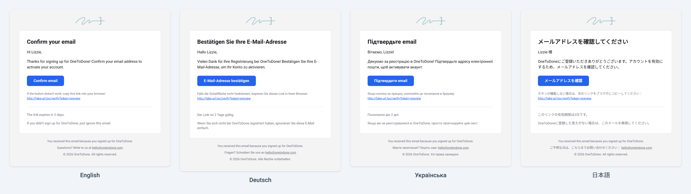

# Texts and locales



| Language             |   Code    |  Built-in  |
| -------------------- | --------- |  :------:  |
| Arabic               | `ar`      |    ❌     |
| Belarusian           | `be`      |    ✅     |
| Belarusian (Latin)   | `be-Latn` |    ✅     |
| Bulgarian            | `bg`      |    ❌     |
| Chinese (Simplified) | `zh`      |    ❌     |
| Croatian             | `hr`      |    ❌     |
| Czech                | `cs`      |    ✅     |
| Danish               | `da`      |    ❌     |
| Dutch                | `nl`      |    ❌     |
| English (default)    | `en`      |    ✅     |
| Estonian             | `et`      |    ✅     |
| Finnish              | `fi`      |    ❌     |
| French               | `fr`      |    ✅     |
| Georgian             | `ka`      |    ✅     |
| German               | `de`      |    ✅     |
| Greek                | `el`      |    ❌     |
| Hebrew               | `he`      |    ❌     |
| Hindi                | `hi`      |    ❌     |
| Hungarian            | `hu`      |    ❌     |
| Indonesian           | `id`      |    ❌     |
| Italian              | `it`      |    ✅     |
| Japanese             | `ja`      |    ✅     |
| Kazakh               | `kk`      |    ❌     |
| Korean               | `ko`      |    ❌     |
| Latvian              | `lv`      |    ✅     |
| Lithuanian           | `lt`      |    ✅     |
| Norwegian            | `nb`      |    ❌     |
| Polish               | `pl`      |    ✅     |
| Portuguese           | `pt`      |    ❌     |
| Romanian             | `ro`      |    ✅     |
| Russian              | `ru`      |    ❌     |
| Serbian              | `sr`      |    ❌     |
| Slovak               | `sk`      |    ❌     |
| Slovenian            | `sl`      |    ❌     |
| Spanish              | `es`      |    ❌     |
| Swedish              | `sv`      |    ❌     |
| Thai                 | `th`      |    ✅     |
| Turkish              | `tr`      |    ❌     |
| Ukrainian            | `uk`      |    ✅     |
| Vietnamese           | `vi`      |    ❌     |

✅ — built-in texts for every template. ❌ — no built-in texts: add the language through `messages`, and every key you leave out falls back to English. Arabic and Hebrew are written right to left, which the default layout does not support.

The examples below reuse `transport`, `from` and `branding` from the [quick start](../README.md#quick-start).

The built-in texts cover the languages marked ✅ in the table; English (`en`) is the default. Set the default with `locale`, and the locale of a single email with the `locale` option of `send` or `render`.

`messages` overrides texts key by key. Every key you leave out keeps its built-in text:

```ts
const mailer = createMailer({
  transport,
  from,
  branding,
  messages: {
    en: {
      resetPassword: { subject: 'Forgot your password?' },
      common: { footerRights: 'All rights reserved worldwide.' },
    },
    be: {
      resetPassword: { subject: 'Аднаўленне доступу', heading: 'Забыліся пароль?' },
    },
  },
})
```

Placeholders in braces are filled in when the email renders. `{companyName}` works in every text, and some texts have their own placeholders (see the table below). An unknown text key throws `INVALID_CONFIG`. The texts of custom templates are overridden the same way, under the template's name (see [texts of custom templates](customization.md#texts-of-custom-templates)).

To add a locale, add its tag to `messages`. It must be a BCP 47 tag such as `sk` or `pt-BR`. Every key the locale leaves out falls back to English, including your `en` overrides. `send`, `render` and the `locale` setting then accept the tag, and TypeScript rejects locales the mailer does not know:

```ts
const mailer = createMailer({
  transport,
  from,
  branding,
  locale: 'sk',
  messages: {
    sk: {
      common: {
        greeting: 'Dobrý deň, {name},',
        minutes: { one: '{count} minútu', few: '{count} minúty', many: '{count} minúty', other: '{count} minút' },
      },
      verifyEmail: {
        subject: 'Potvrďte svoj e-mail',
        heading: 'Potvrďte svoj e-mail',
        button: 'Potvrdiť e-mail',
      },
    },
  },
})

await mailer.send('verifyEmail', {
  to: 'zuzana@example.com',
  props: { verifyUrl: 'https://example.com/verify?token=abc123' },
})

await mailer.render('passwordChanged', { locale: 'nl' }) // type error: "nl" is not a locale of this mailer
```

Plural forms (`common.minutes`, `common.hours`, `common.days`) take one text per [plural category](https://developer.mozilla.org/en-US/docs/Web/JavaScript/Reference/Global_Objects/Intl/PluralRules/select) of the locale: `zero`, `one`, `two`, `few`, `many` and `other`. `{count}` is replaced by the number. A category without a text uses `other`.

When you declare `messages` outside the `createMailer` call, check it with `satisfies MessagesOverrides` rather than a type annotation. An annotation widens the keys to `string`, and the mailer loses its list of locales. For the texts of custom templates, use `MessagesOverrides<typeof templates>` (see [texts of custom templates](customization.md#texts-of-custom-templates)):

```ts
import type { MessagesOverrides } from '@onetodone/mailer'

const messages = {
  sk: { verifyEmail: { subject: 'Potvrďte svoj e-mail' } },
} satisfies MessagesOverrides
```

Text keys:

| Section                  | Keys                                                                                                                                                             | Placeholders                                                                                                             |
| ------------------------ | ---------------------------------------------------------------------------------------------------------------------------------------------------------------- | ------------------------------------------------------------------------------------------------------------------------ |
| `common`                 | `greeting`, `greetingAnonymous`, `linkFallback`, `footerSupport`, `footerRights`, `minutes`, `hours`, `days`                                                     | `{name}` in `greeting`, `{count}` in the plural forms                                                                    |
| `verifyEmail`            | `subject`, `preheader`, `heading`, `intro`, `button`, `expires`, `ignore`                                                                                        | `{duration}` in `expires`                                                                                                |
| `resetPassword`          | `subject`, `preheader`, `heading`, `intro`, `button`, `expires`, `ignore`                                                                                        | `{duration}` in `expires`                                                                                                |
| `passwordChanged`        | `subject`, `preheader`, `heading`, `intro`, `changedAt`, `ip`, `ifYou`, `notYou`, `button`, `notYouEmail`                                                        | `{date}` in `changedAt`, `{ip}` in `ip`, `{email}` in `notYouEmail`                                                      |
| `verifyEmailChange`      | `subject`, `preheader`, `heading`, `intro`, `button`, `expires`, `ignore`                                                                                        | `{duration}` in `expires`                                                                                                |
| `emailChangeRequested`   | `subject`, `preheader`, `heading`, `intro`, `requestedAt`, `ip`, `ifYou`, `notYouCancel`, `cancelButton`, `notYou`, `button`, `notYouEmail`                      | `{newEmail}` in `intro` and `ifYou`, `{date}` in `requestedAt`, `{ip}` in `ip`, `{email}` in `notYouEmail`               |
| `emailChanged`           | `subject`, `preheader`, `heading`, `intro`, `newEmail`, `changedAt`, `ip`, `newAddress`, `ifYou`, `notYou`, `button`, `notYouEmail`                              | `{newEmail}` in `newEmail`, `{date}` in `changedAt`, `{ip}` in `ip`, `{email}` in `notYouEmail`                          |
| `otpCode`                | `subject`, `preheader`, `heading`, `intro`, `expires`, `doNotShare`, `ignore`                                                                                    | `{code}` in `subject` and `preheader`, `{duration}` in `expires`                                                         |
| `magicLink`              | `subject`, `preheader`, `heading`, `intro`, `button`, `expires`, `doNotShare`, `ignore`                                                                          | `{duration}` in `expires`                                                                                                |
| `welcome`                | `subject`, `preheader`, `heading`, `intro`, `button`                                                                                                             |                                                                                                                          |
| `newSignIn`              | `subject`, `preheader`, `heading`, `intro`, `signedInAt`, `device`, `location`, `ip`, `ifYou`, `notYouSecure`, `secureButton`, `notYou`, `button`, `notYouEmail` | `{date}` in `signedInAt`, `{device}` in `device`, `{location}` in `location`, `{ip}` in `ip`, `{email}` in `notYouEmail` |
| `twoFactorEnabled`       | `subject`, `preheader`, `heading`, `intro`, `changedAt`, `ip`, `ifYou`, `notYou`, `button`, `notYouEmail`                                                        | `{date}` in `changedAt`, `{ip}` in `ip`, `{email}` in `notYouEmail`                                                      |
| `twoFactorDisabled`      | `subject`, `preheader`, `heading`, `intro`, `changedAt`, `ip`, `ifYou`, `notYou`, `button`, `notYouEmail`                                                        | `{date}` in `changedAt`, `{ip}` in `ip`, `{email}` in `notYouEmail`                                                      |
| `accountLocked`          | `subject`, `preheader`, `heading`, `intro`, `lockedUntil`, `ip`, `unlock`, `unlockButton`, `help`, `button`, `helpEmail`, `notYou`                               | `{date}` in `lockedUntil`, `{ip}` in `ip`, `{email}` in `helpEmail`                                                      |
| `confirmAccountDeletion` | `subject`, `preheader`, `heading`, `intro`, `warning`, `button`, `expires`, `ignore`                                                                             | `{duration}` in `expires`                                                                                                |
| `accountDeleted`         | `subject`, `preheader`, `heading`, `intro`, `farewell`, `notYou`, `button`, `notYouEmail`                                                                        | `{email}` in `notYouEmail`                                                                                               |

The `Messages` type describes every key, so your editor shows what each text is for as you type.

`Messages` is the full built-in dictionary, and it gains keys whenever built-in templates are added, in any release. A full dictionary typed as `Messages` is therefore not covered by semver. Check your own texts with `satisfies MessagesOverrides` (or type one locale as `LocaleMessages`); keys you leave out fall back to English.

`Locale` lists the built-in locales and gains values whenever a built-in locale is added, in any release, so code that requires every `Locale` value (such as `Record<Locale, …>`) is not covered by semver. If you already use a locale through `messages` and it becomes built-in, your overrides still win; keys you did not override come from the built-in texts instead of English.
