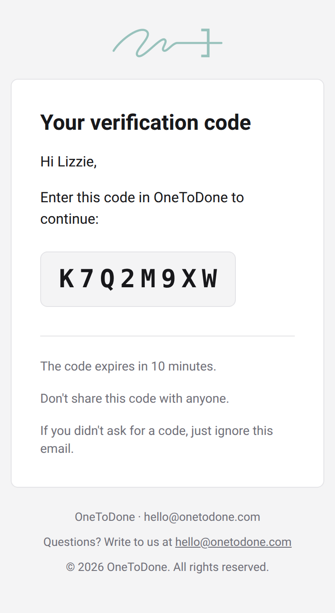

# Security

- Every value inserted into email HTML is escaped: in built-in templates, in `ui` blocks and in the `html` tag. `raw` and `ui.raw` are the only ways to insert unescaped markup, so never pass user input to them.
- Links in buttons, fallback links and built-in props must be absolute `http:` or `https:` URLs. `javascript:`, `data:` and relative links are rejected.
- Line breaks are rejected in addresses, display names and header values, and all control characters in attachment file names and content types, which blocks header injection whatever the transport.
- Hook events leave out the email body, the props and attachment content, and error messages never repeat link values or attachment content, so both are safe to log.
- `consoleTransport` prints links with tokens. Use it in development only.
- For deliverability, send from a domain with SPF, DKIM and DMARC set up. Every email includes a plain-text version.

## Email client support

The HTML follows what email clients actually render:

- nested tables and inline styles;
- no `<style>` block apart from an Outlook-only font fallback;
- a VML button for Outlook on Windows;
- fixed image dimensions;
- a hidden preheader for the inbox preview.

The layout declares support for light and dark color schemes. It is checked in Gmail (web and mobile apps), Outlook, Apple Mail and iOS Mail, in light and dark mode and on screens 320px wide.

